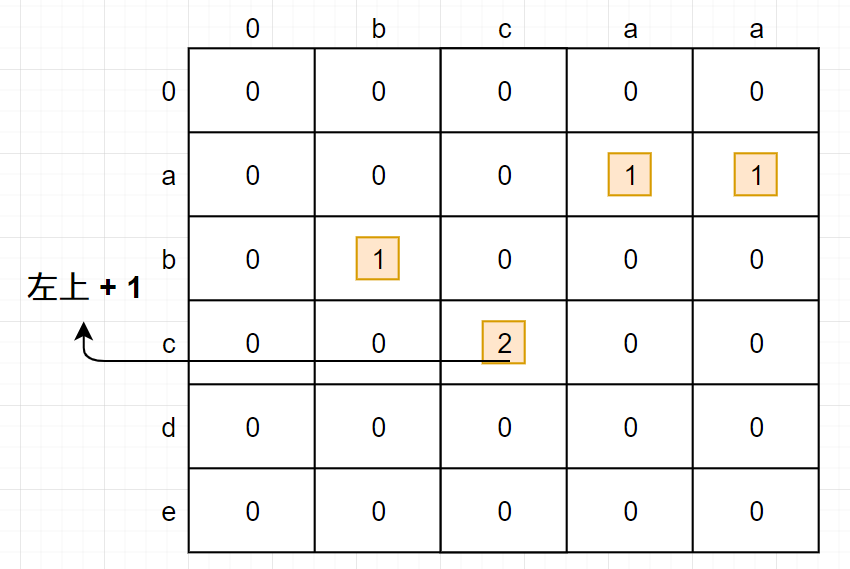
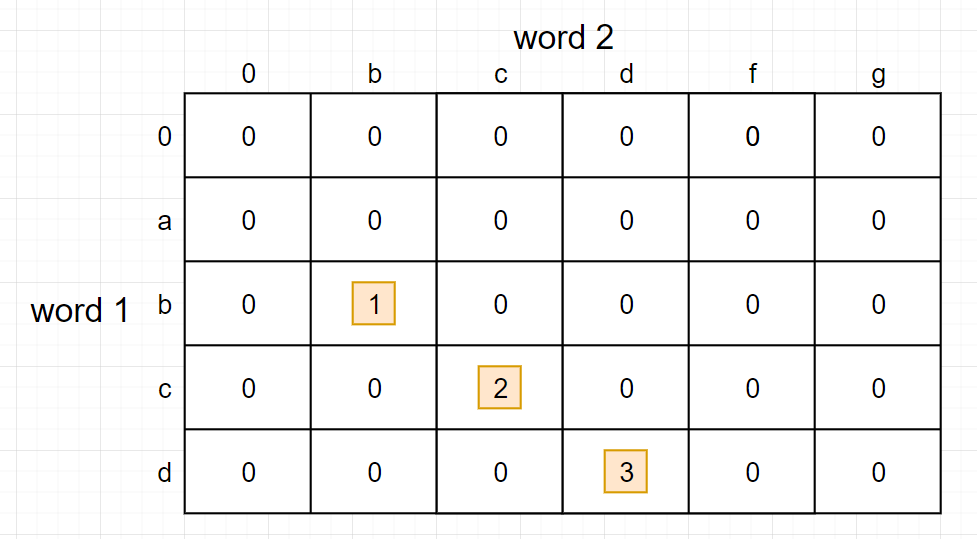

# Longest Common Substring

## Problem

Find longest common substring of two inputs
- Definition of substring: 連續的 chars
    - Example: LCS of "abcde" and "aaafcdgg" is "cd"

## Dynamic Programming Approach

- 建立 DP table, `dp[0, 0]` 為 0
  - 只要 `word1[i] == word2[j]`
    - `dp[i, j] = d[i-1, j-1] + 1`
    - 斜左上格 + 1，儲存在 `dp[i, j]`

-  例如 `word1` = `"abcde"`, `word2` = `"bcaa"`
   -  LCS = `bc`
 

- 例如 `word1` = `"abcd"`, `word2` = `"bcdfg"`
  - LCS = `bcd`

## Tips

- word1/word2 在 row 或在 column 都沒差，table 建好就好
- 記得 `dp[0,0]` 是 0，要從 `dp[0,1]` 或 `dp[1,0]` 開始建 table
