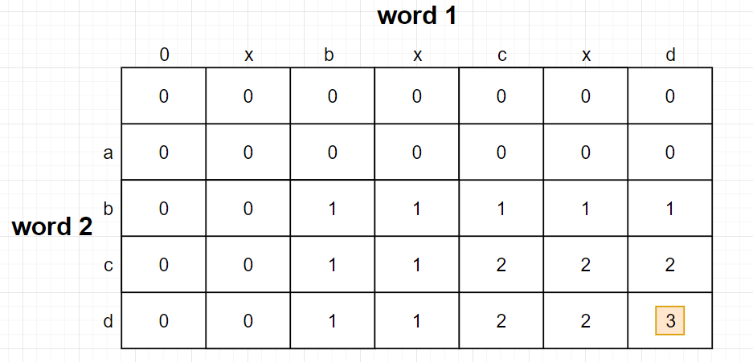

# Longest Common Subsequence

## Problem

Find longest common *subsequence* of two inputs
- Definition of subsequence: 不一定要連續的 chars，只要有重複就是 common subsequence
    - Example: Longest Common Subsequence of `"axbxcxd"` and `"bcd"` is `"bcd"`
    - PS: Substring: 連續的 chars

## Dynamic Programming Approach

- 和 Longest Common Substring 很像，只是若 `word1[i] != word2[j]` 時，`dp[i, j]` 為上或下最大的那格值
  - `dp[i, j] = max(dp[i-1, j], dp[i, j-1])`

- 建立 DP table, `dp[0, 0]` 為 0
  - 只要 `word1[i] == word2[j]`
    - `dp[i, j] = d[i-1, j-1] + 1`
    - 左上格 + 1，儲存在 `dp[i, j]`
  - 若 `word1[i] != word2[j]`
    - 上方和左方做比較，取最大值當作此格
    - `dp[i, j] = max(dp[i-1, j], dp[i, j-1])`

- 例如 `word1` = `"xbxcxd"`, `word2` = `"abcd"`
  - LCS = `bcd`

## Tips

- 追蹤 Longest Common Subsequence:
  - 比較麻煩，要記錄是從上、左、還是左上來的，如果 `dp[i, j]` 是由 `dp[i-1, j-1]+1` 而來，就是 subsequence
