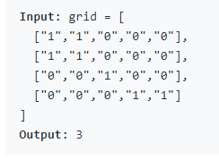

# Depth-first search

## Problem

DFS is an algorithm for traversing or searching a tree/graph. 
One starts at the root and traverses as far as possible.

DFS 一般可以透過 Stack 實現

## Stack implementation

- 先將 root 加到 stack
- 利用 while loop，只要 stack 不是空的:
  - current = stack.pop()
  - 加入所有可行的 node 到 stack 裡後重複執行直到 stack 為空
  - 注意只要可行的都要加到 stack，不要用 if-elif 排除

## Code example

```python
stack = [root]
while stack:
    cur = stack.pop()
    if cur.left:
        stack.append(cur.left)
    if cur.right:
        stack.append(cur.right)
```

## Leetcode example

- Problem: [200. Number of Islands](https://leetcode.com/problems/number-of-islands/)
- 
- 1 代表陸地，0 代表海洋，找出島嶼個數
  - 很明顯的要使用 DFS 找出目前這個點所在的島嶼，並標記該島嶼為"路過"
  - 如果走到 "1" 且未被標記路過，則丟到 DFS 找出該"陸地"所屬島嶼的點的位置
- 中間有點亂，不過主要就是找所有可行的陸地位置 (相鄰上下左右)，要避免 out-of-index

```python
class Solution:
    def numIslands(self, grid: List[List[str]]) -> int:
        visit = [[False for _ in grid[0]] for _ in grid]
        def dfs(r,c):
            stack = [(r,c)]
            while stack:
                cur_r, cur_c = stack.pop()
                visit[cur_r][cur_c] = True
                if cur_r-1 >= 0 and not visit[cur_r-1][cur_c] and grid[cur_r-1][cur_c] == "1":
                    stack.append((cur_r-1, cur_c))
                if cur_r+1 < len(visit) and not visit[cur_r+1][cur_c] and grid[cur_r+1][cur_c] == "1":
                    stack.append((cur_r+1, cur_c))
                if cur_c-1 >= 0 and not visit[cur_r][cur_c-1] and grid[cur_r][cur_c-1] == "1":
                    stack.append((cur_r, cur_c-1))
                if cur_c+1 < len(visit[0]) and not visit[cur_r][cur_c+1] and grid[cur_r][cur_c+1] == "1":
                    stack.append((cur_r, cur_c+1))
        
        count = 0
        for r in range(len(grid)):
            for c in range(len(grid[0])):
                if grid[r][c] == "1" and not visit[r][c]:
                        dfs(r,c)
                        count += 1
        
        return count
```