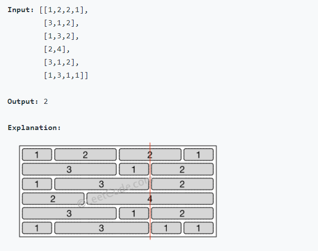

# 554. Brick Wall

- Link: https://leetcode.com/problems/brick-wall/

## Problem

> 找切法可以切到最少 blocks，並 output 這種切法會遇到的 block count，牆壁兩邊不能算

## My Solution

1. 用 hash table，先建立方塊間隔的座標 list，例如第一 row 會是 `[1, 3, 5, 6]`，第二 row 會是 `[3, 4, 6]`
2. 對每個座標點 1~6 (不用原點的) 計算間隔出現的次數，例如座標點 1 有 3 個間隔
3. 找出最多間隔的 case (照我這種算法會是右邊的牆, 6，所以找次多的)，得到結果為座標 4 (共4個間隔)
4. 最多有六行 = 六個方塊，經過四個間隔，答案為 `6 - 4 = 2`

Tips: 如果 hash table 只有一個座標點，例如 `table = { 3: 4 }` ，座標點 3 有四格間隔，代表此題怎麼切都會經過四個方塊，output 為 4

## Result

1. Runtime: 204 ms, faster than 16.11% of Python3 online submissions for Brick Wall.
2. Memory Usage: 19.1 MB, less than 86.09% of Python3 online submissions for Brick Wall.

## Improvements

1. 不用做到右邊的牆
2. 其他人的做法也差不多，好像沒啥好改進的