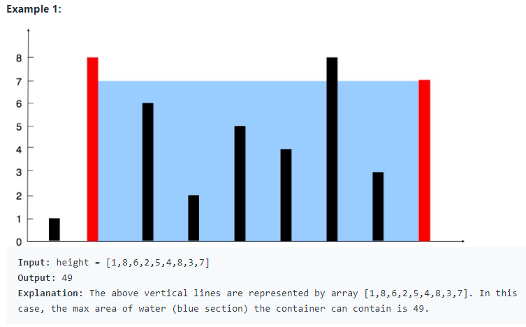

# 11. Container With Most Water

* Link: [https://leetcode.com/problems/container-with-most-water/](https://leetcode.com/problems/container-with-most-water/)

## Problem

>Given n non-negative integers a1, a2, ..., an , where each represents a point at coordinate (i, ai). n vertical lines are drawn such that the two endpoints of the line i is at (i, ai) and (i, 0). Find two lines, which, together with the x-axis forms a container, such that the container contains the most water.
> Notice that you may not slant the container.



## My Solution

- 這題的 TLE 蠻嚴格的，需要想出很有技巧的解法
- 從最大寬度考慮，如果想讓寬度縮小，那新的邊界 (左或右) 的高度一定要比舊的(左或右)還高，不然縮小寬度後不可能比原本的多

## Result

- Runtime: 604 ms, faster than 98.50% of Python3 online submissions for Container With Most Water.
- Memory Usage: 27.4 MB, less than 59.41% of Python3 online submissions for Container With Most Water.

## Time and Space complexity

- Time: O(n)
- Space: O(1)

## Improvements

- 一開始沒想到如何解，還是該從問題本身考慮，而不是先想怎麼用演算法
- 考慮常識: 寬度縮小後，如果高度降低，那裝的水只會更少

## Code

```python
class Solution:
    def maxArea(self, height: List[int]) -> int:
        left = 0
        right = len(height)-1
        
        max_area = 0
        
        while left < right:
            h = min(height[left], height[right])
            max_area = max(h * (right-left), max_area)
            while height[left] <= h and left < right:
                left += 1
            while height[right] <= h and left < right:
                right -= 1
        return max_area
```