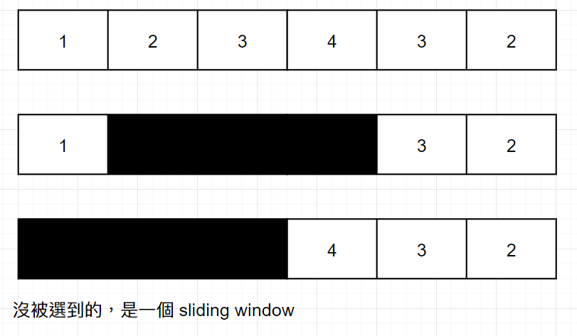
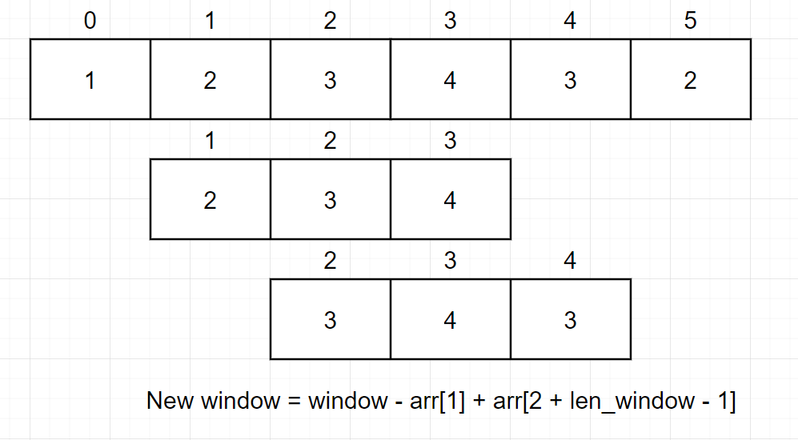

# 1423. Maximum Points You Can Obtain from Cards

* Link: [https://leetcode.com/problems/maximum-points-you-can-obtain-from-cards/](https://leetcode.com/problems/maximum-points-you-can-obtain-from-cards/)

## Problem

> There are several cards arranged in a row, and each card has an associated number of points The points are given in the integer array cardPoints.
> In one step, you can take one card from the beginning or from the end of the row. You have to take exactly k cards.
> Your score is the sum of the points of the cards you have taken.
> Given the integer array cardPoints and the integer k, return the maximum score you can obtain.

給一組數字 array，並且給一 number k，每一次只能從最前方或最後方選，選 k 數字求最大值

## My Solution

1. 因為限定只能從前面或後面選，所以最後沒被選到的會是一個 sliding window



2. 所以取答案的方法是 `answer = max(answer, total - sum of window)`
3. 原本的作法是直接抓 `cardPoints[i:i+window]` 取 `sum` 後做比較，但是會 `TLE`
4. 後來發現可以不用抓整個 array，只要 maintain 好前一格的 window sum，刪掉 window 的第一格並且加上新的 number 就可以了
   - `window = window - prev_start + new_card_num`



## Result

- Runtime: 448 ms, faster than 26.86% of Python3 online submissions for Maximum Points You Can Obtain from Cards.
- Memory Usage: 27.7 MB, less than 31.99% of Python3 online submissions for Maximum Points You Can Obtain from Cards.

## Time and Space complexity

- Time: `O(n)`
  - 最差情況: `k = 2`，需要 iterate 到第 `n-1` 格
- Space: `O(1)`
  - 只有儲存 `window` 的數值，沒有用到多餘空間

## Improvements

- 這個 Problem 是從 Google onsite 來的
- 主要沒什麼好改的，可以寫得更簡潔一點
  
```python
class Solution:
    def maxScore(self, cardPoints: List[int], k: int) -> int:
        s = sum(cardPoints[:k])
        res = s
        for i in range(1, k+1):
            s += cardPoints[-i] - cardPoints[k-i]
            res = max(res, s)
        return res
```

## Code

```python
class Solution:
    def maxScore(self, cardPoints: List[int], k: int) -> int:
        if k == 1:
            return max(cardPoints[0], cardPoints[-1])
        if k == len(cardPoints):
            return sum(cardPoints)
        
        total = sum(cardPoints)
        sel_len = len(cardPoints) - k
        window = sum(cardPoints[0:sel_len])
        prev_start = 0
        answer = max(0, total - window)
        
        for i in range(1, len(cardPoints)-sel_len+1):
            window = window - cardPoints[prev_start] + cardPoints[i+sel_len-1]
            answer = max(answer, total - window)
            prev_start = i
            
        return answer
```