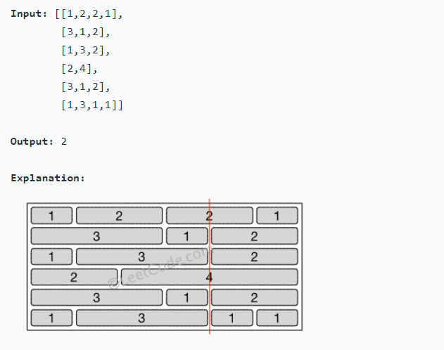

# 554. Brick Wall

* Link: [https://leetcode.com/problems/brick-wall/](https://leetcode.com/problems/brick-wall/)

## Problem

> 找切法可以切到最少 blocks，並 output 這種切法會遇到的 block count，牆壁兩邊不能算



## My Solution

1. 用 hash table，先建立方塊間隔的座標 list，例如第一 row 會是 `[1, 3, 5, 6]`，第二 row 會是 `[3, 4, 6]`
2. 對每個座標點 1~6 \(不用原點的\) 計算間隔出現的次數，例如座標點 1 有 3 個間隔
3. 找出最多間隔的 case \(照我這種算法會是右邊的牆, 6，所以找次多的\)，得到結果為座標 4 \(共4個間隔\)
4. 最多有六行 = 六個方塊，經過四個間隔，答案為 `6 - 4 = 2`

Tips: 如果 hash table 只有一個座標點，例如 `table = { 3: 4 }` ，座標點 3 有四格間隔，代表此題怎麼切都會經過四個方塊，output 為 4

## Result

1. Runtime: 204 ms, faster than 16.11% of Python3 online submissions for Brick Wall.
2. Memory Usage: 19.1 MB, less than 86.09% of Python3 online submissions for Brick Wall.

## Improvements

1. 不用做到右邊的牆
2. 其他人的做法也差不多，好像沒啥好改進的

## Code

```python
class Solution:
    def leastBricks(self, wall: List[List[int]]) -> int:
        # Build empty occurence map for each point
        occur_table = {}
        for i in range(len(wall)):
            # calculate empty points
            prev = 0
            for j in range(len(wall[i])):
                wall[i][j] += prev
                prev = wall[i][j]
                # save result into occur_table
                if wall[i][j] not in occur_table.keys():
                    occur_table[wall[i][j]] = 1
                else:
                    occur_table[wall[i][j]] += 1
        res = sorted(occur_table.items(), key=lambda s:s[1])
        if len(res) == 1:
            return res[0][1]
        else:
            return (res[-1][1] - res[-2][1])

```