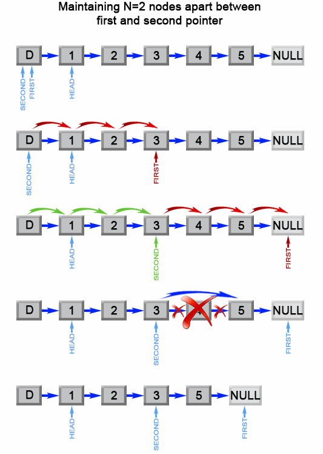

# 19. Remove Nth Node From End of List

* Link: [https://leetcode.com/problems/remove-nth-node-from-end-of-list/](https://leetcode.com/problems/remove-nth-node-from-end-of-list/)

## Problem

> Given the head of a linked list, remove the nth node from the end of the list and return its head.

## Follow Up

> Follow up: Could you do this in one pass?

## My Solution

1. 第一個iter: 建立 doubly-linked list, 並移到 tail
2. 從 tail 開始向前，找到要移除的點，並重新連接 List 後 return
3. 注意邊緣 case 和只有一個 node 的 case

   ```python
    [1], remove 1 -> return None
   ```

## Result

1. Runtime: 91.71%
2. Time complexity = `L + L-1 = 2L-1 = O(L)`
3. Space complexity = `O(1)`


## Improvements

1. One-pass: 原本使用的方法需要雙 pass \(先建立反向list，再從tail找到該點移除\)
2. 利用兩個 Pointer，gap 固定為 n+1 1. Fast 先走 n+1 步 2. Fast, Slow 再一次走 1 步，Fast 走到底 \(NULL\) 3. Slow 的 next 設定為 Slow→next→next

   ```python
        slow.next = slow.next.next
   ```

   1. Return dummy head

3. 因為原本差 n+1，這樣可以把第 n 個直接銷掉



## Code

```python
# Definition for singly-linked list.
# class ListNode:
#     def __init__(self, val=0, next=None):
#         self.val = val
#         self.next = next
class Solution:
    def removeNthFromEnd(self, head: ListNode, n: int) -> ListNode:
        # only one
        if head.next == None and n == 1:
            return None
                
        orig_head = head
        prev = None
        # get last node
        while head.next != None:
            head.prev = prev
            prev = head
            head.next.prev = head
            head = head.next
        
        tail = head
        if n == 1:
            tail.prev.next = None
        else:
            for i in range(0, n-1):
                tail = tail.prev

            if tail.prev == None: # start of list
                orig_head = tail.next
                return orig_head
                
            tail.next.prev = tail.prev
            tail.prev.next = tail.next
        
        return orig_head
```