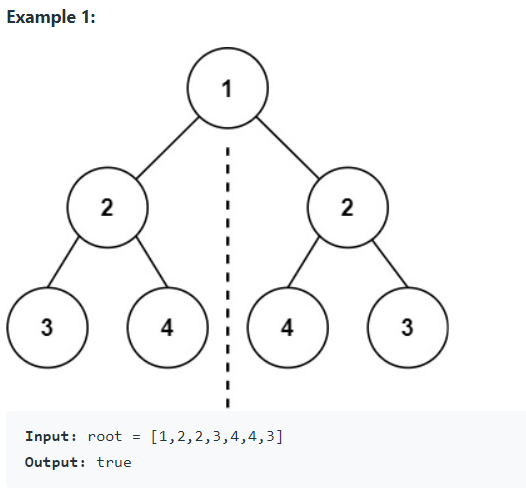
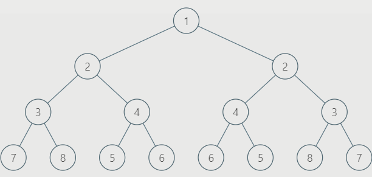

# 101. Symmetric Tree

* Link: [https://leetcode.com/problems/symmetric-tree/](https://leetcode.com/problems/symmetric-tree/)

## Problem

>Given the root of a binary tree, check whether it is a mirror of itself (i.e., symmetric around its center).



## My Solution

1. 跟 [100. Same Tree](100.-Same-Tree.md) 很像，不過只比較 `root.left` 和 翻轉過的 `root.right`
2. 比前面一題多了一個翻轉 tree 的 function

- Invert:
  - 先 recursion 換 `node.left`, `node.right`
  - 再把目前 node 的 left，right 互換

```python
def invert(node):
    if not node:
        return
    invert(node.left)
    invert(node.right)
    
    tmp = node.left
    node.left = node.right
    node.right = tmp
    # no need to return
```

## Result

- Runtime: 28 ms, faster than 92.99% of Python3 online submissions for Symmetric Tree.
- Memory Usage: 14.4 MB, less than 43.00% of Python3 online submissions for Symmetric Tree.

## Time and Space complexity

- Time: `O(n)`，`invert` 和 `sameTree` 都是 `O(n)`
  - `sameTree` 的分析可以看前一題
  - `invert` 會遍查全部的 node (of right tree)，因此是 `O(n)`
- Space: `O(n)`
  - `invert` 的 recursion call 要放到 stack 上面，最差情況是全部都要存進去 stack

## Improvements

- 觀察 Symtree



- 發現可以 recursion 檢查 left subtree 是否和 right subtree 是 symmetric

```python
def isSymmetric(self, root):
    def isSym(L,R):
        if L and R and L.val == R.val: 
            return isSym(L.left, R.right) and isSym(L.right, R.left)
        return L == R
    return not root or isSym(root.left, root.right)
```

## Code

```python
# Definition for a binary tree node.
# class TreeNode:
#     def __init__(self, val=0, left=None, right=None):
#         self.val = val
#         self.left = left
#         self.right = right
class Solution:
    def isSymmetric(self, root: TreeNode) -> bool:
        def invert(node):
            if not node:
                return
            invert(node.left)
            invert(node.right)
            
            tmp = node.left
            node.left = node.right
            node.right = tmp
        
        def sameTree(p, q):
            if not p and not q:
                return True
            if p and q:
                return p.val == q.val and \
                    sameTree(p.left, q.left) and \
                    sameTree(p.right, q.right)
            
        
        invert(root.right)
        return sameTree(root.left, root.right)
```