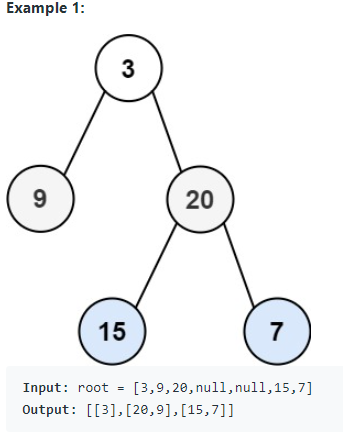

# 103. Binary Tree Zigzag Level Order Traversal

* Link: [https://leetcode.com/problems/binary-tree-zigzag-level-order-traversal/](https://leetcode.com/problems/binary-tree-zigzag-level-order-traversal/)

## Problem

>Given the root of a binary tree, return the zigzag level order traversal of its nodes' values. (i.e., from left to right, then right to left for the next level and alternate between).



## My Solution

- 利用 level-order traversal
- 需要知道現在 traverse 到第幾 level，最後再決定是不是要 reverse (zig-zag)
- 利用一個 hash table，紀錄每個 level 的所有 node (left child, right child)
- Traverse 先走 left child 再 right，主要是保留原本的 Tree-structure

## Result

- Runtime: 32 ms, faster than 70.83% of Python3 online submissions for Binary Tree Zigzag Level Order Traversal.
- Memory Usage: 14.6 MB, less than 42.45% of Python3 online submissions for Binary Tree Zigzag Level Order Traversal.

## Time and Space complexity

- Time: O(n)，Traverse 一次 tree
- Space: O(n)，需要額外存所有 node

## Improvements

- 看了一下其他人也是用類似的作法，不過不用 hash table 存，而是直接用現在第幾 level，判斷如何存到 result (是否要 reverse)
- 或是用 queue，參考

```python
class Solution:
    def zigzagLevelOrder(self, root):
        if not root: return []
        queue = deque([root])
        result, direction = [], 1
        
        while queue:
            level = []
            for i in range(len(queue)):
                node = queue.popleft()
                level.append(node.val)
                if node.left:  queue.append(node.left)
                if node.right: queue.append(node.right)
            result.append(level[::direction])
            direction *= (-1)

```

## Code

```python
class Solution:
    def zigzagLevelOrder(self, root: TreeNode) -> List[List[int]]:
        if not root:
            return []
        
        res = {"0": [root.val]}
        
        level = 0
        
        def trav(node, level):
            if not node:
                return
            level += 1
            
            if str(level) not in res.keys():
                res[str(level)] = []
            if node.left:
                res[str(level)].append(node.left.val)
            if node.right:
                res[str(level)].append(node.right.val)
            
            trav(node.left, level)
            trav(node.right, level)
            
        trav(root, level)
        final = []
        for k,v in res.items():
            if v:
                if int(k) % 2 != 0:
                    final.append(v[::-1])
                else:
                    final.append(v)
                
        return final
```