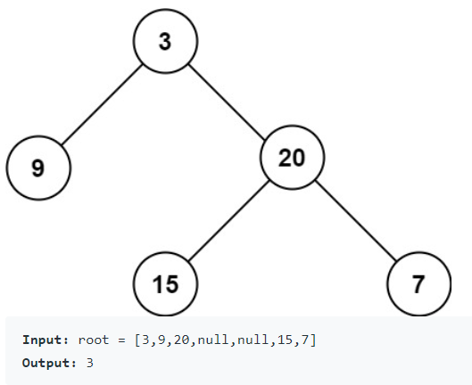

# 104. Maximum Depth of Binary Tree

* Link: [https://leetcode.com/problems/maximum-depth-of-binary-tree/](https://leetcode.com/problems/maximum-depth-of-binary-tree/)

## Problem

>Given the root of a binary tree, return its maximum depth.
> A binary tree's maximum depth is the number of nodes along the longest path from the root node down to the farthest leaf node.



## My Solution

1. 原本以為是 [Level order traversal](https://www.geeksforgeeks.org/level-order-tree-traversal/) 的問題，不過發現答案一直會有點問題
2. 後來改用 recursion，思路:
   1. 利用 Bottom-up，回傳 left subtree 和 right subtree 的深度，並取較大的那個
   2. 若 left、right 都為 `null`，代表到底，回傳 `1`
   3. 若一邊為 `null`，回傳不是 `null` 的那邊 subtree depth

## Result

- Runtime: 44 ms, faster than 39.76% of Python3 online submissions for Maximum Depth of Binary Tree.
- Memory Usage: 16.4 MB, less than 13.91% of Python3 online submissions for Maximum Depth of Binary Tree.

## Time and Space complexity

- Time: `O(log n) ~ O(n)`
  - 利用 bottom-up 的方法，會到達 tree 的最底層
  - 最差情況: 全部都只在同一邊 -> `O(n)`
  - 最佳情況: Balanced binary tree -> `O(log n)`
- Space: `O(1)`，沒有用到別的空間

## Improvements

- 更精簡的寫法，不過本質相同: 回傳 `max(左 tree, 右 tree)` 的深度

```python
class Solution:
    def maxDepth(self, root):
        if root is None:
            return 0
        return max(self.maxDepth(root.left), self.maxDepth(root.right)) + 1
```
- 稍微快了一點 (4ms)
    - Runtime: 40 ms, faster than 71.36% of Python3 online submissions for Maximum Depth of Binary Tree.
    - Memory Usage: 16 MB, less than 57.80% of Python3 online submissions for Maximum Depth of Binary Tree.

## Code

```python
# Definition for a binary tree node.
# class TreeNode:
#     def __init__(self, val=0, left=None, right=None):
#         self.val = val
#         self.left = left
#         self.right = right
class Solution:
    def maxDepth(self, root: TreeNode) -> int:
        if not root:
            return 0
        
        def depth(root):
            if root.left and root.right:
                return max(depth(root.left), depth(root.right)) + 1
            # 到達最底部
            if not root.left and not root.right:
                return 1
            # 只有一邊的情況
            if root.left and not root.right:
                return depth(root.left) + 1
            if not root.left and root.right:
                return depth(root.right) + 1
        
        return depth(root)
```