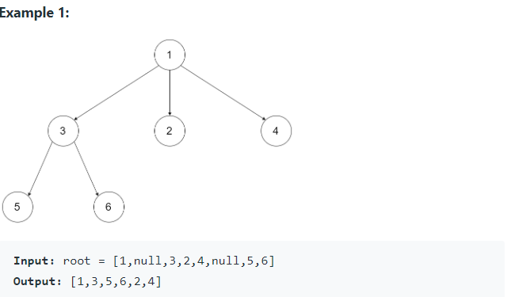

# 589. N-ary Tree Preorder Traversal

* Link: [https://leetcode.com/problems/n-ary-tree-preorder-traversal/](https://leetcode.com/problems/n-ary-tree-preorder-traversal/)

## Problem

> Given the root of an n-ary tree, return the preorder traversal of its nodes' values.



## Follow Up

> Follow up: Recursive solution is trivial, could you do it iteratively?

## My Solution

1. 就 recursion，沒有很特別

   ```python
    def recursion_sol(node):
            result.append(node.val)
            # recursion: to current node's children
            for child in node.children:
                    recursion_sol(child)
   ```

2. 注意邊界條件 \(empty list\)
3. 難點還是在搞懂題目和給的 input，直接寫個 proof-of-concept \(例如印出root.child\) 就很快解了

## Result

1. Runtime: 57%

   

## Improvements

1. Stack! 1. While Stack is still not NULL: 1. Pop the stack and add the node value to result 2. Add the children of the popped node in reverse order

   ```python
            popped = stack.pop()
            stack.extend(popped.children[::-1])
   ```

   * 為何要用 reverse order?
     * Example: children 1 = \[3, 2, 4\]，若不用 reverse，會讓 4 第一個被 pop 出來，而這不是我們要的
     * 我們要 1, 3, 2, 4，而不是 1, 4, 2, 3
   * Python extend: 因為 children 是一個 list，用 append 會變 list of list

     

