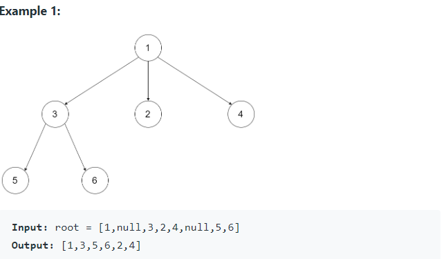

# 589. N-ary Tree Preorder Traversal

- Link: https://leetcode.com/problems/n-ary-tree-preorder-traversal/

## Problem

> Given the root of an n-ary tree, return the preorder traversal of its nodes' values.



## Follow Up

> Follow up: Recursive solution is trivial, could you do it iteratively?

## My Solution

1. 就 recursion，沒有很特別

    ```python
    def recursion_sol(node):
    		result.append(node.val)
    		# recursion: to current node's children
    		for child in node.children:
    				recursion_sol(child)
    ```

2. 注意邊界條件 (empty list)
3. 難點還是在搞懂題目和給的 input，直接寫個 proof-of-concept (例如印出root.child) 就很快解了

## Result

1. Runtime: 57%


## Improvements

1. Stack!
    1. While Stack is still not NULL:
        1. Pop the stack and add the node value to result
        2. Add the children of the popped node in reverse order

            ```python
            popped = stack.pop()
            stack.extend(popped.children[::-1])
            ```

    - 為何要用 reverse order?
        - Example: children 1 = [3, 2, 4]，若不用 reverse，會讓 4 第一個被 pop 出來，而這不是我們要的
        - 我們要 1, 3, 2, 4，而不是 1, 4, 2, 3
    - Python extend: 因為 children 是一個 list，用 append 會變 list of list

        